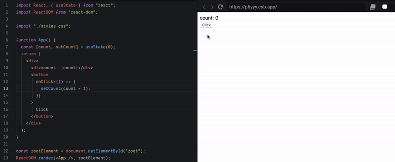
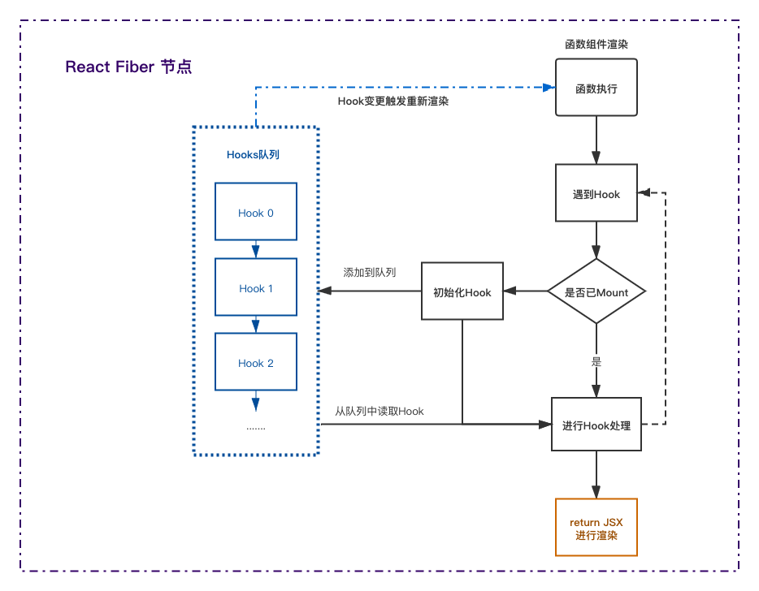
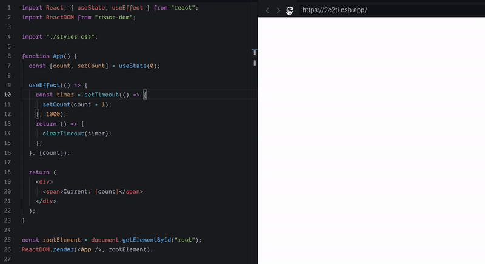
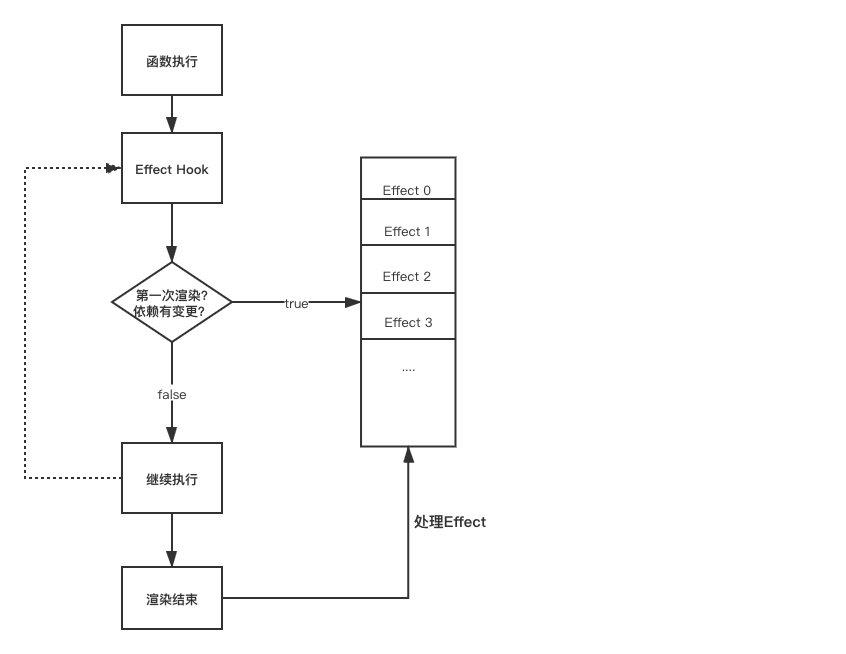
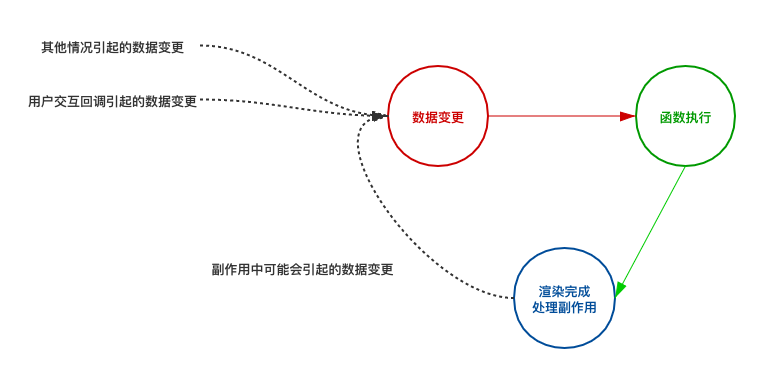

# React Hooks 从入门到放弃

> 本文默认读者对 React Hooks 已经有一定的了解。 因此不再赘述 Hooks API 的使用了, 还未了解的同学可以去官网阅读[React Hooks API Reference](https://reactjs.org/docs/hooks-reference.html)

1. 上手使用
2. 遇到问题
3. React Hooks 源码分析
4. 函数式组件的思想
5. 抽象封装 Hooks

这篇文章的目的是什么?

1. 了解 Hooks 原理, 减少使用 Hooks 开发时的 BUG
2. 如何抽象合适的 Hooks
3. 如何书写具有可读性的 React 函数组件

## React Hooks 基础

使用 React Hooks 就不得不提到 React 函数组件。

> Conceptually, components are like JavaScript functions. They accept arbitrary inputs (called “props”) and return React elements describing what should appear on the screen.

从官网上的介绍来看, 组件就像 JavaScript 的函数, 它接收一些入参(props), 并返回 React 元素。

在我们最初学习使用 React 框架时, 首先了解的是通过`Class`书写组件, 这样可以很好地理解并规划`类组件`的数据与方法, 而且`生命周期`可以让我们更清晰地了解组件的加载以及更新状态的触发时机。

那`函数组件`呢? `函数组件`本身解决了从数据到 React 元素的映射, 而`Hooks`则在此基础上提供了数据存储以及 Side Effect(副作用)的处理。

此时此刻, 让我们忘记已经熟知的`Class`与`生命周期`, 来重新认识`函数组件` + `Hooks`的 React。

### 0. 函数组件

`函数组件`是用来处理一些简单的 UI 组件, 通过 Props 传入的数据, 抽象封装一些组件。

```jsx
function Header(props) {
    const { title, description, avatar } = props;
    return (
        <div>
            
            <h1>{title}</h1>
            <p>{description}</p>
        </div>
    );
}
```

限制了函数组件使用的原因一方面在于它没有内部数据, 另一方面就是没有生命周期, 因此无法实现具有一定交互与逻辑的功能。

### 1. 使用 React Hooks 时的数据存储

函数组件内定义的变量不是固化的, 执行完成后, 函数内的变量就会被清理掉了(非闭包情况)。所以, 我们需要通过 Hooks 固化组件需要的一些数据。

[](https://codesandbox.io/s/gracious-glitter-p6yyy?autoresize=1&fontsize=14&hidenavigation=1)



上面是 React Hooks 之 useState 的使用例子, 如下是浅尝辄止的理解:

> 通过`useState`, 我们在某个地方定义了一个对象, 并挂载到某个不会让它消失的地方。`useState`方法返回的第一个值就是我们要的数据。`useState`方法返回的第二个值是一个函数, 可以设置这个对象的值, 然后会触发函数重新渲染。

上面这坨话说的很模糊, `某个地方`到底是哪个地方, 定义了一个什么样的`对象`, 又挂载到了什么地方。设置了新值后又是怎么触发渲染的???


如果想从根源上填上这个坑, 大概是需要阅读源码了解 Hooks 的基础实现的[Github 源码链接](https://github.com/facebook/react/blob/d259f458133865757c0d18895d537f14908f0a5b/packages/react-reconciler/src/ReactFiberHooks.js#L142)。

本文尝试通过流程图来简述下这里的逻辑。(下面的流程图是不完整的!没有对比依赖更新)



-   函数组件第一次执行时

第一个 Hook 会挂载到`React Fiber Node`上, 之后在函数执行遇到的 Hook 会依次按顺序挂载到 Hook 节点后。

-   函数组件更新渲染时

函数执行遇到的 Hooks 会按照顺序读取`React Fiber Node`上的 Hook 节点。

如上图所示, 函数组件重新执行时是依赖 Hooks 队列的顺序的。如果在`条件判断`中使用 Hook 就会让这个队列错乱。

因此也就会有如下官网提示:

> Only call Hooks at the top level. Don’t call Hooks inside loops, conditions, or nested functions.

### 2. 使用 React Hooks 处理副作用

副作用(Side Effect), 个人理解, 是在`数据->视图`的转化过程中, 出现的一些特别的`时机`。我们可以利用这些`时机`去处理一些业务逻辑。

以下是使用`useEffect`的一个简单的计数 Demo.

[](https://codesandbox.io/s/old-butterfly-2c2ti?fontsize=14&hidenavigation=1&theme=dark)



使用`useEffect`去实现在渲染完成之后要去处理的一些事情。
大家也可以在官网的API Reference中找到React useEffect说明。

我们可以通过流程图加深理解`useEffect`这个Hook。



以上是`useEffect`Hook的大致执行逻辑, 通过此图会发现`useEffect`多了一步`数据比对`的过程, 只有当以下条件成立时, SideEffect才会触发调用。
1. useEffect第一次执行之时 
2. useEffect的依赖存在变更之时

我们修改上面计数的例子就可以更好的理解两个Hook。

[](https://codesandbox.io/s/priceless-water-w2r4b?fontsize=14&hidenavigation=1&theme=dark)

```javascript
function Demo(props) {
  const [count, setCount] = useState(0);
  const [step, setStep] = useState(1);

  useEffect(() => {
    const timer = setTimeout(() => {
      setCount(step + count);
    }, 1000)
    return () => {
      clearTimeout(timer);
    }
  }, [count]);

  return (
    <div>
    <div>Count: {count}</div>
    <div>Step: {step}</div>
      <button
        onClick={() => {
          setCount(count + 1);
        }}
      >
        Click
      </button>
      </div>);
}
```

在Gift图中, 在更新Step步长时, 计数第一次仍然是`+1`, 随后才会`+2`。
1. 在`step`更新时, `useEffect`的`count`没有变化, 所以没有触发更新
2. `useEffect`触发时, 使用的是Hook中暂存的数据, 所以步长`step`仍然是1.

所以, 
函数组件的流程认知要**Update**下



### 3. 总结

本文只是提到了`useState`, `useEffect`这两例典型的React Hooks。

以`useState`为例, 我们了解了`React Hooks`是如何解决函数组件内无法保留内部数据的问题。
以`useEffect`为例, 我们呢了解了`React Hooks`如何处理在`数据->视图`之间一些`时机`的处理

以及很浅显的提到了`Hook`中的数据暂存(快照)的原因

下一章会着重于《如何在业务中梳理重组封装自己的Hooks》

## Hooks 的合理使用

简单粗暴的改写 Class 组件, 代码对比

```
// TODO: 冗长的Function代码
```

按照官网提供的 Hooks API, 我们将一个 Class 组件改造成了 Function + Hooks 组件

看上去这个函数很混乱, 可读性也很差, 那使用 React Hooks 真的优雅吗？

那看下面这份代码

```
// TODO: 重构Function的代码
```

> 函数式编程是一种编程范式，它将电脑运算视为函数运算，并且避免使用程序状态以及易变对象。其中，λ 演算（lambda calculus）为该语言最重要的基础。而且，λ 演算的函数可以接受函数当作输入（引数）和输出（传出值）。
> 比起指令式编程，函数式编程更加强调程序执行的结果而非执行的过程，倡导利用若干简单的执行单元让计算结果不断渐进，逐层推导复杂的运算，而不是设计一个复杂的执行过程。

函数式思维的一种转换: 输入与输出

每一次渲染都是`来源 -> 数据变更 -> 视图 -> 执行SideEffect`的过程, 这是一条主流, 那可以进行如下重组:

多个(数据, 来源, 副作用) => 视图 === 来源 ->数据变更 -> 视图 -> 执行 SideEffect


## UseCallback 地狱