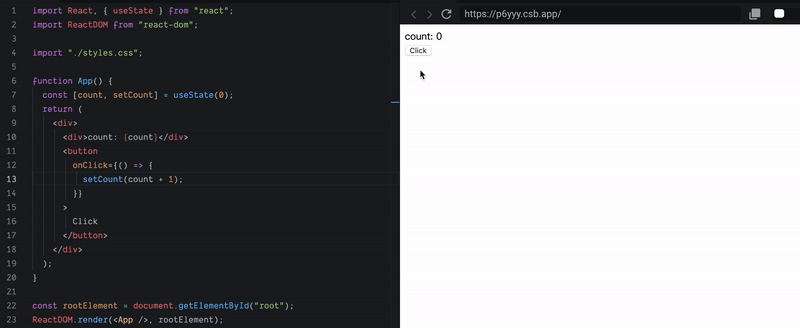
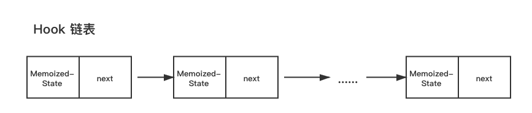
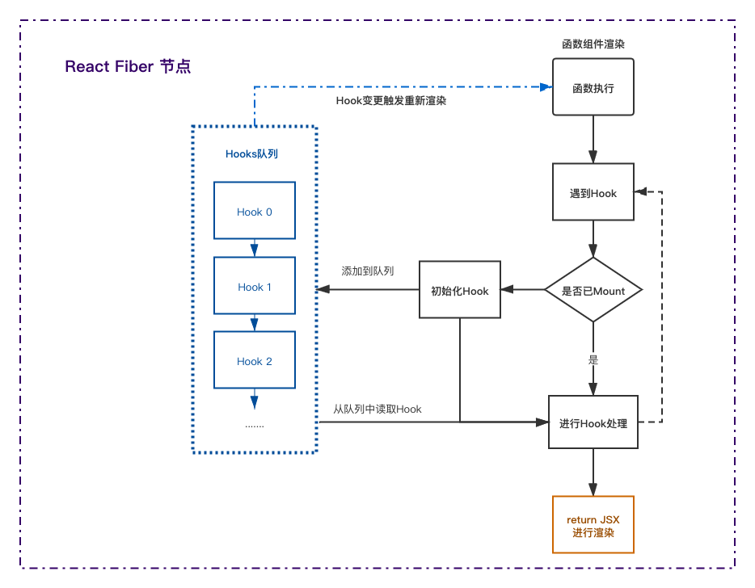
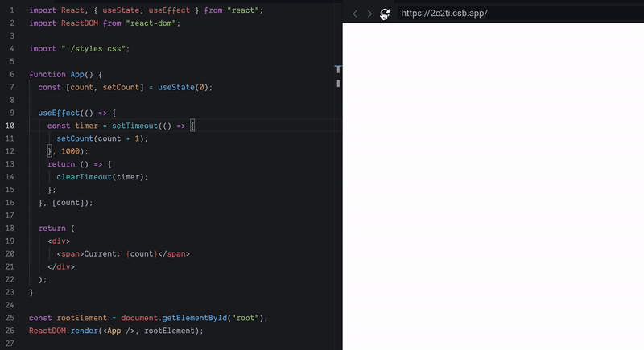
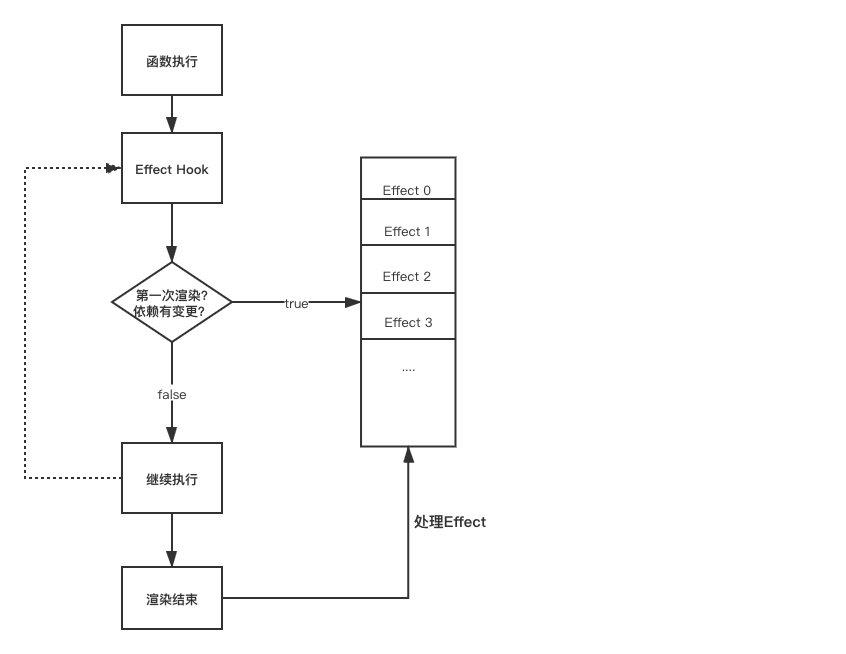
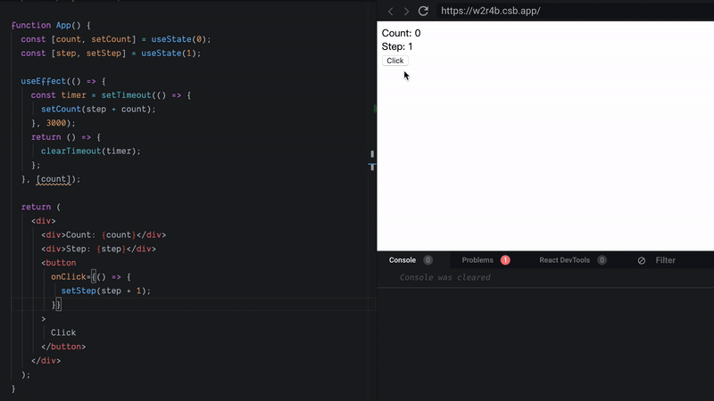
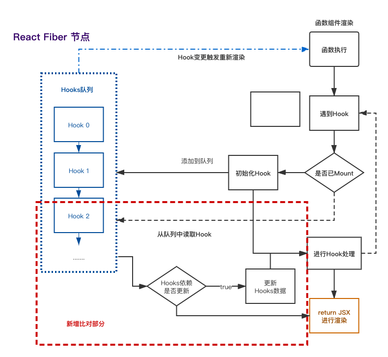
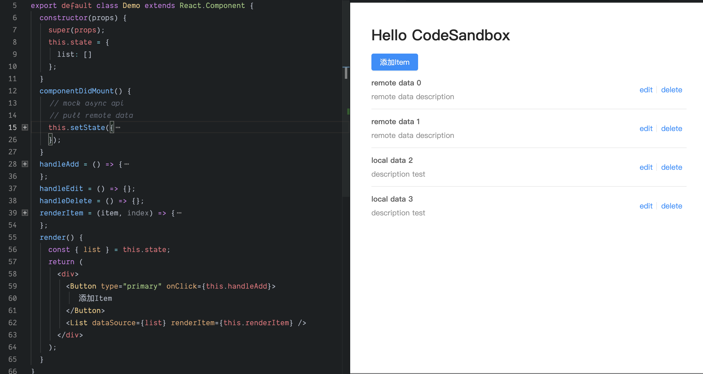
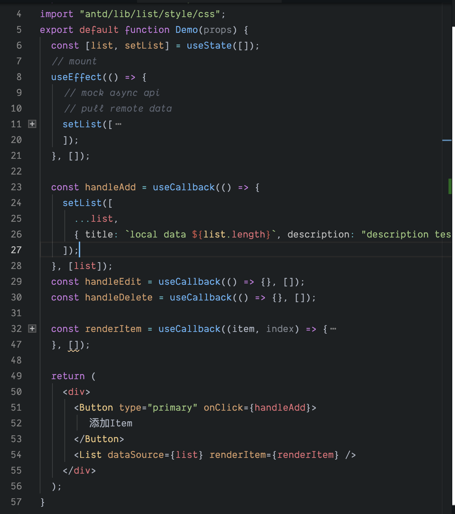
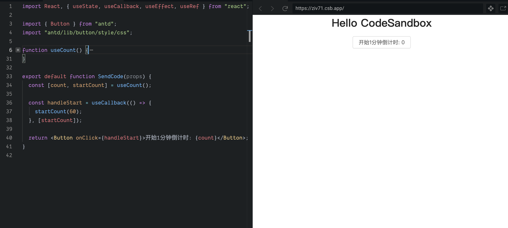

# React Hooks 从入门到放弃

> 本文默认读者对 React Hooks 已经有一定的了解。 因此不再赘述 Hooks API 的使用了, 还未了解的同学可以去官网阅读[React Hooks API Reference](https://reactjs.org/docs/hooks-reference.html)

## React Hooks 基础

使用 React Hooks 就不得不提到 React 函数组件。

> Conceptually, components are like JavaScript functions. They accept arbitrary inputs (called “props”) and return React elements describing what should appear on the screen.

从官网上的介绍来看, 组件就像 JavaScript 的函数, 它接收一些入参(props), 并返回 React 元素。

在我们最初学习使用 React 框架时, 首先了解的是通过`Class`书写组件, 这样可以很好地理解并规划`类组件`的数据与方法, 而且`生命周期`可以让我们更清晰地了解组件的加载以及更新状态的触发时机。

那`函数组件`呢? `函数组件`本身解决了从数据到 React 元素的映射, 而`Hooks`则在此基础上提供了数据存储以及 Side Effect(副作用)的处理。

此时此刻, 让我们忘记已经熟知的`Class`与`生命周期`, 来重新认识`函数组件` + `Hooks`的 React。

### 0. 函数组件

`函数组件`是用来处理一些简单的 UI 组件, 通过 Props 传入的数据, 抽象封装一些组件。

```jsx
function Header(props) {
    const { title, description, avatar } = props;
    return (
        <div>
            
            <h1>{title}</h1>
            <p>{description}</p>
        </div>
    );
}
```

限制了函数组件使用的原因一方面在于它没有内部数据, 另一方面就是没有生命周期, 因此无法实现具有一定交互与逻辑的功能。

### 1. 使用 React Hooks 时的数据存储

函数组件内定义的变量不是固化的, 执行完成后, 函数内的变量就会被清理掉了(非闭包情况)。所以, 我们需要通过 Hooks 固化组件需要的一些数据。

[](https://codesandbox.io/s/gracious-glitter-p6yyy?autoresize=1&fontsize=14&hidenavigation=1)



上面是 React Hooks 之 useState 的使用例子, 如下是浅尝辄止的理解:

> 通过`useState`, 我们在某个地方定义了一个对象, 并挂载到某个不会让它消失的地方。`useState`方法返回的第一个值就是我们要的数据。`useState`方法返回的第二个值是一个函数, 可以设置这个对象的值, 然后会触发函数重新渲染。

上面这坨话说的很模糊, `某个地方`到底是哪个地方, 定义了一个什么样的`对象`, 又挂载到了什么地方。设置了新值后又是怎么触发渲染的???


如果想从根源上填上这个坑, 大概是需要阅读源码了解 Hooks 的基础实现的[Github 源码链接](https://github.com/facebook/react/blob/d259f458133865757c0d18895d537f14908f0a5b/packages/react-reconciler/src/ReactFiberHooks.js#L142)。

下面是`Hook`的 type 定义

```typescript
export type Hook = {
    // 数据
    memoizedState: any;
    // 下面这些暂时不需要了解
    baseState: any;
    baseQueue: Update<any, any> | null;
    queue: UpdateQueue<any, any> | null;
    // 链表下一个节点的指针
    next: Hook | null;
};
```

我们需要了解的是`Hook`是通过`链表`存储的


本文尝试通过流程图来简述下这里的逻辑。(下面的流程图是不完整的!没有对比依赖更新)



-   函数组件第一次执行时

第一个 Hook 会挂载到`React Fiber Node`上, 之后在函数执行遇到的 Hook 会依次按顺序挂载到 Hook 节点后。

-   函数组件更新渲染时

函数执行遇到的 Hooks 会按照顺序读取`React Fiber Node`上的 Hook 节点。

如上图所示, 函数组件重新执行时是依赖 Hooks 队列的顺序的。如果在`条件判断`中使用 Hook 就会让这个队列错乱。

因此也就会有如下官网提示:

> Only call Hooks at the top level. Don’t call Hooks inside loops, conditions, or nested functions.

### 2. 使用 React Hooks 处理副作用

副作用(Side Effect), 个人理解, 是在`数据->视图`的转化过程中, 出现的一些特别的`时机`。我们可以利用这些`时机`去处理一些业务逻辑。

以下是使用`useEffect`的一个简单的计数 Demo.

[](https://codesandbox.io/s/old-butterfly-2c2ti?fontsize=14&hidenavigation=1&theme=dark)



使用`useEffect`去实现在渲染完成之后要去处理的一些事情。
大家也可以在官网的 API Reference 中找到 React useEffect 说明。

我们可以通过流程图加深理解`useEffect`这个 Hook。



以上是`useEffect`Hook 的大致执行逻辑, 通过此图会发现`useEffect`多了一步`数据比对`的过程, 只有当以下条件成立时, SideEffect 才会触发调用。

1. useEffect 第一次执行之时
2. useEffect 的依赖存在变更之时

我们修改上面计数的例子就可以更好的理解两个 Hook。

[](https://codesandbox.io/s/priceless-water-w2r4b?fontsize=14&hidenavigation=1&theme=dark)

```javascript
function Demo(props) {
    const [count, setCount] = useState(0);
    const [step, setStep] = useState(1);

    useEffect(() => {
        const timer = setTimeout(() => {
            setCount(step + count);
        }, 1000);
        return () => {
            clearTimeout(timer);
        };
    }, [count]);

    return (
        <div>
            <div>Count: {count}</div>
            <div>Step: {step}</div>
            <button
                onClick={() => {
                    setCount(count + 1);
                }}
            >
                Click
            </button>
        </div>
    );
}
```



在 Gift 图中, 在更新 Step 步长时, 计数第一次仍然是`+1`, 随后才会`+2`。

1. 在`step`更新时, `useEffect`的`count`没有变化, 所以没有触发更新
2. `useEffect`触发时, 使用的是 Hook 中暂存的数据, 所以步长`step`仍然是 1.

我们在Hook加载流程上补充上对比的过程。



Hook中存入的是上一次渲染后的快照值, 所以在执行时, 也会使用上一次渲染留下来的值。

到这里, 我们概括下函数组件的渲染流程


### 3. 总结

本文只是提到了`useState`, `useEffect`这两例典型的 React Hooks。

以`useState`为例, 我们了解了`React Hooks`是如何解决函数组件内无法保留内部数据的问题。

以`useEffect`为例, 我们呢了解了`React Hooks`如何处理在`数据->视图`之间一些`时机`的处理

以及很浅显的提到了`Hook`中的数据暂存(快照)的原因

React Hooks 还有很多种用法, 本章只是梳理 React Hooks 的一些基本概念。

下一章会着重于《如何在业务中梳理重组封装自己的 Hooks》

### 4. 参考Reference

[React Hook 解析 - 风吹老了好少年的文章 - 知乎](https://zhuanlan.zhihu.com/p/91935584)

## Hooks 的合理使用

作者最初使用`React Hooks`的场景就是用`Hooks`重构现有的 Class 组件。

改写 Class 组件也没有很难, 对照官网 API, 直接暴力输出

1. 使用`useState`替代`this.state`
2. 使用`useCallback`替代 Class 的方法
3. 使用`useEffect`替代生命周期函数
4. ...


首先, 来看一个使用 Class 实现的组件, 支持列表的增删查改(不好意思, 只实现了增);

[](https://codesandbox.io/s/stoic-cerf-cgu0l?fontsize=14&hidenavigation=1&theme=dark)


### 重构组件

按照上面的暴力输出思路和官网提供的`Hooks`API, 我们将一个 Class 组件改造成了 Function + Hooks 组件试试。

[](https://codesandbox.io/s/stoic-cerf-cgu0l?fontsize=14&hidenavigation=1&theme=dark)


看上去好像没什么问题, 有一种重构代码`大功告成`的感觉。可内心总有一点点不安, 这不安来自于哪里呢?

在身边的同事看到这段代码后, 吐槽地说了一句, `使用React Hooks看上去好乱阿, 在一个函数里写了一坨代码, 不像OOP那样逻辑清晰`。

仔细想想, 好像确实是这个样子的。 重构后的组件代码逻辑都在同一个函数中, 看上去逻辑不清晰、可阅读性很差、维护困难。

这么简单的组件改写后都这么乱了, 逻辑更复杂一些的组件, 就是更大一坨的意大利面了==


### 代码优化

> 放弃使用 React Hooks? 难道它就真的不香吗?!

考虑到自己的代码能力是渣中本渣, 所以一定是自己的使用姿势有问题了。那就看看能不能继续优化下去吧!

#### 1. 封装语义化 useEffect

在上面代码中, 使用`useEffect`模拟了`componentDidMount`这一生命周期。React 官方推荐使用多个`useEffect`去完成不同的事情, 而不是放在一起。那我们可以对此进行一定的封装处理。

```javascript
// useMount sourcecode
import { useEffect } from 'react';
const noop = () => {};
export function useMount(mount, unmount = noop) {
    useEffect(() => {
        mount();
        return () => {
            unmount();
        };
    }, []);
}
```

```jsx
// use case
export default function Demo(props) {
    useMount(() => {
        // do something
        // after didMount
    });
}
```

2. 封装 Hooks

在上述组件中, 使用了`useState`, 并在`添加`,`编辑`,`删除`等操作中都调用了修改 State 的`setXXX`方法。

像这样的`数据-操作`有着相关联系的, 我们可以封装自己的 Hooks

```javascript
import { useState, useCallback } from 'react';

export function useList(initial = []) {
    const [list, setList] = useState(initial);

    const add = useCallback(data => {
        // setXXX使用函数后, 入参会拿到最新的state数据
        setList(list => [...list, data]);
    }, []);
    const edit = useCallback(data => {}, [list]);
    const deleteOne = useCallback(data => {}, [list]);

    return [list, add, edit, deleteOne];
}
```

上述`数据结构-操作方法`只是最简单的一种方案。更多的使用方法和抽象封装要具体情况具体分析来使用了。

所以在上述封装之后,

```javascript
export default function Demo() {

    const [list, add, edit, deleteOne] = useList([]);
    const handleAdd = useCallback(() => {
        add({
            title: `local data ${list.length}`,
            description: 'description test'
        });
    }, []);
    const handleEdit = useCallback(() => {}, []);
    const handleDelete = useCallback(() => {}, []);
    
    usetMount(() => {});
    //...
    // 其他不变
}
```

### 方法论

> 方法论主要解决“怎么办”的问题。

下文只是个人对`React Hooks`的实践总结, 如果有更好的思路欢迎来拍砖。

这里提到的**方法论**, 是在使用函数组件 + React Hooks时, 我们该怎么合理的应用它。

首先, 将注意力回到最初提到的`函数组件`, 它实际上就是`数据=>视图`, 一组特殊的输入输出的函数。

```js
v = f(p)
```
函数组件与React Hooks体现的都是函数式编程的思想, 即:

> 函数式编程是一种编程范式，它将电脑运算视为函数运算，并且避免使用程序状态以及易变对象。其中，λ 演算（lambda calculus）为该语言最重要的基础。而且，λ 演算的函数可以接受函数当作输入（引数）和输出（传出值）。
> 比起指令式编程，函数式编程更加强调程序执行的结果而非执行的过程，倡导利用若干简单的执行单元让计算结果不断渐进，逐层推导复杂的运算，而不是设计一个复杂的执行过程。

在上文中提到了`数据 -> 视图 -> SideEffect`这样的流程。

每一次渲染都是`不同情况引起 -> 数据变更 -> 视图更新 -> 执行SideEffect`的过程, 这是一条主线的渲染流程, 那可以进行如下重组:

`每一次渲染` === `多个(数据, 操作指令, 副作用)` => `视图` => `SideEffect处理`

我们更需要关心`(数据, 操作指令, 副作用)`这个元组, 如何将多个元组在这个渲染流程中合并成一条`数据 -> 视图 -> SideEffect`是React Fiber架构实现的事情。这个心智操作由React框架解决。我们只要正确实现`(数据, 操作指令, 副作用)`的封装就好了。

而这是我们可以使用`React Hooks`做到的事情, 也是我们如何合理的封装使用`React Hooks`的方法论。


个人觉得`倒计时`是一个不错的例子

```js
import React, { useState, useCallback, useEffect, useRef } from "react";

export function useCount() {
  const [count, setCount] = useState(0);
  const timer = useRef(null);

  useEffect(() => {
    timer.current = setTimeout(() => {
      if (count > 0) {
        setCount(count - 1);
      }
    }, 1000);

    return () => {
      clearTimeout(timer.current);
    };
  }, [count]);

  const startCount = useCallback(count => {
    setCount(count);
  }, []);

  const stopCount = useCallback(() => {
    clearTimeout(timer.current);
  }, []);

  return [count, startCount, stopCount];
}
```
我们使用`useCount`这个封装的Hook, 提供了数据->`count`, 操作->`startCount`, 内部使用`useEffect`封装了使用`setTimeout`倒计时的逻辑。



### 总结

本文着重点在于如何合理地使用React Hooks, 提出了对书写`函数组件+ReactHooks`的方法论的思考。

封装Hooks也是基于可扩展可维护的实用角度出发。 本文也是提醒自己不要为了写Hooks而写Hooks。


## UseCallback 地狱
